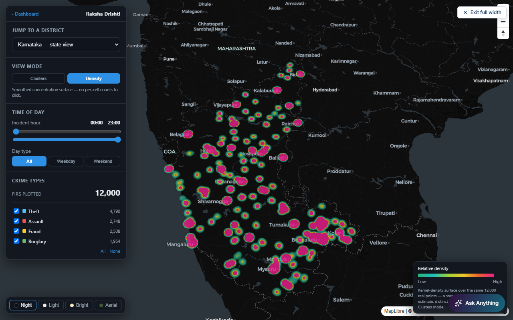
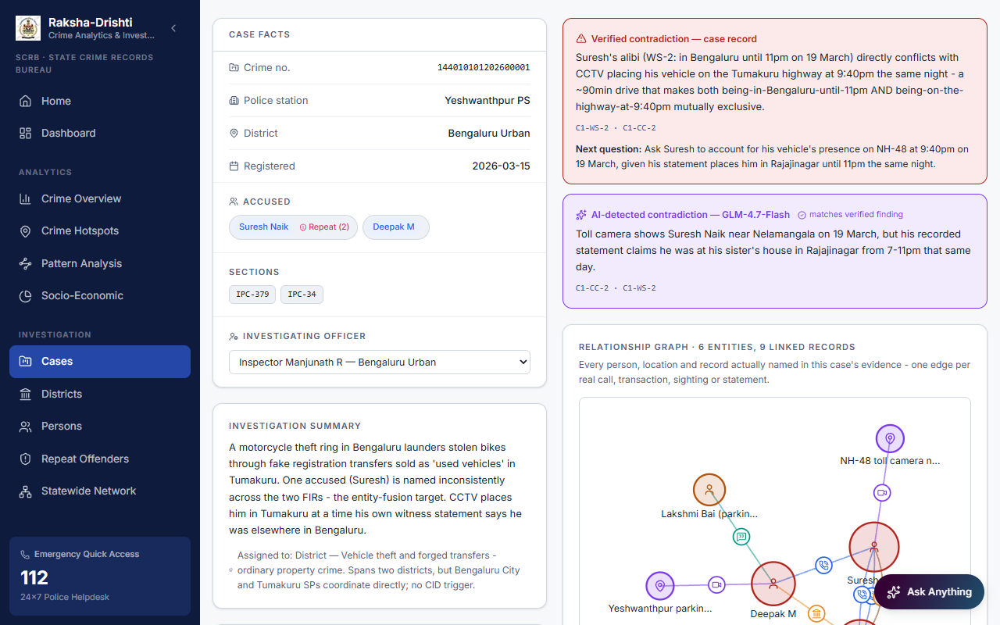
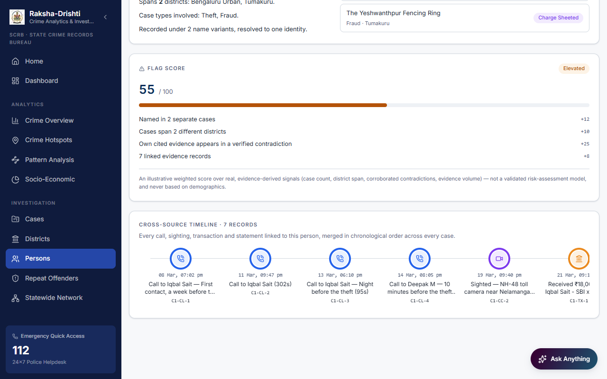
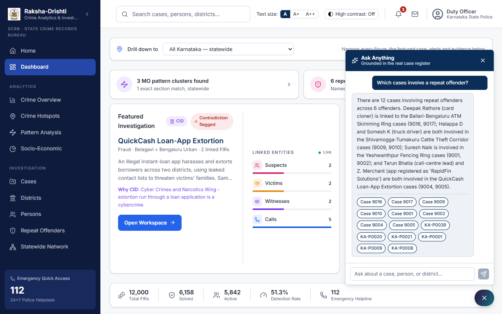
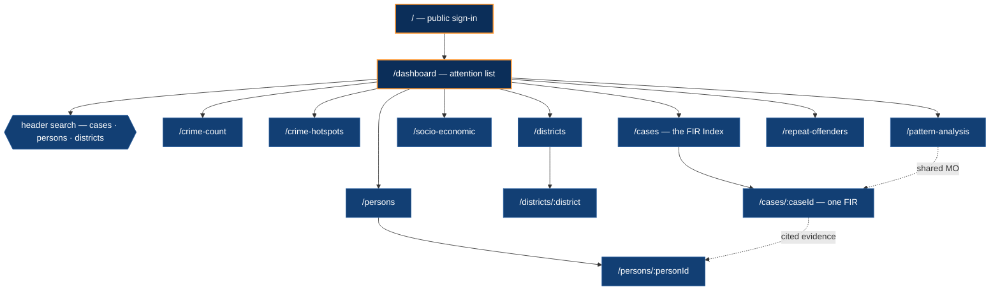

<div align="center">



<br>


### **[▶ Open the live prototype](https://raksha-drishti-v2-byahjtre.onslate.in/)**

<i>Raksha-Drishti — "protection through vision."</i>
<br>
<b>A statewide crime-records intelligence portal for the Karnataka State Crime Records Bureau.</b>

<br>



</div>

---

## The problem, as SCRB actually experiences it

The State Crime Records Bureau is the custodian of crime data for the whole
state — and is precisely where fragmentation hurts most. Records arrive from
district units in incompatible shapes; the Bureau is expected to answer
statewide questions from them.

<table>
<tr><th width="50%">What SCRB faces today</th><th width="50%">What Raksha-Drishti does about it</th></tr>
<tr>
<td><b>Records are fragmented.</b> FIRs, station registers and evidence artefacts sit in separate systems with no join key. The same person is four different rows.</td>
<td><b>Entity fusion.</b> One person is resolved to one canonical <code>KA-Pxxxx</code> identity across five source shapes — including sources that carry no ID at all, only a name buried in a free-text account label.</td>
</tr>
<tr>
<td><b>Statewide patterns surface late.</b> A series running across three districts looks like three unrelated local cases until someone happens to notice.</td>
<td><b>Cross-district pattern detection.</b> MO clustering on shared and rare Act+Section signatures, cross-district flow mapping, and a repeat-offender register that spans jurisdictions rather than stopping at a district line.</td>
</tr>
<tr>
<td><b>Trend reporting is retrospective.</b> Monthly compilations tell you what already happened; abnormal movement is judged by eye.</td>
<td><b>Statistical trend anomaly detection.</b> Control charts flag movement outside expected variation, alongside a time-of-day × day-of-week concentration heatmap and per-district pendency and clearance rates.</td>
</tr>
<tr>
<td><b>Investigators cross-reference by hand.</b> Checking a statement against a call log, a transaction and a camera sighting is manual, slow, and easy to skip.</td>
<td><b>One merged timeline per person, and a detector over it.</b> Contradictions across sources are flagged automatically — and every flag cites the exact record IDs it came from.</td>
</tr>
</table>

> [!IMPORTANT]
> **The design rule this whole project is built around:** the AI never produces
> a number, and never makes a claim it cannot cite. Scores, counts, clusters and
> rates are computed arithmetic over real records. The model writes explanations
> and questions — and any finding whose cited record ID is not present in the
> data handed to it is **dropped before it can render**.

---

## See it running

<table>
<tr>
<td width="50%">

<!-- Static screenshot for now (kernel-density mode) - predates the 31-district expansion; see assets/README.md for the recapture + animated-GIF path -->


**Statewide hotspots**
Choropleth, kernel density and cross-district flow layers over 12,000 georeferenced incidents across all 31 Karnataka districts, scrubbable across 2022–2026.

</td>
<td width="50%">

<!-- Static screenshot for now - see assets/README.md for the animated-GIF upgrade path -->


**FIR → case → contradiction**
The FIR Index down to one case: facts, sections, sibling FIRs, the evidence timeline, and contradictions **shown with their citations**.

</td>
</tr>
<tr>
<td width="50%">

<!-- Static screenshot for now - see assets/README.md for the animated-GIF upgrade path -->


**Person fusion**
One individual assembled from calls, CCTV, transactions and statements — across scenarios, not just within one.

</td>
<td width="50%">

<!-- Static screenshot for now - see assets/README.md for the animated-GIF upgrade path -->


**Ask Anything**
A tool-calling agent over the whole dataset — not a prompt stuffed with 12,000 rows — every citation checked against the real register before it can render. Multi-round tool calls can take real time (or occasionally give up rather than guess); shown here mid-query, not a canned response.

</td>
</tr>
</table>

---

## What is built

| | Capability | Backed by |
|---|---|---|
| 🗺️ | **Hotspot mapping** — choropleth, kernel density, spatiotemporal and cross-district flow layers | `crime-map/*`, `districtGeo.ts`, `crossDistrictFlows.ts` |
| 📊 | **Crime analytics** — category and district counts, 5-year trend with control-chart anomaly detection, time-of-day × day-of-week heatmap, chargesheet-rate analysis, case-flow Sankey | `crimeCountStats.ts`, `components/crimeCount/*` |
| 🗂️ | **FIR Index** — all 12,000 FIRs, filterable by type, district, status and free text; the daily-use worklist screen | `caseWorklist.ts`, `/cases` |
| 📁 | **Case record** — facts, sections, sibling FIRs, cross-source evidence timeline, relationship graph, IO assignment, and a **real status write** to the live Data Store | `/cases/[caseId]`, `PATCH /api/cases/[caseId]/status` |
| 🧬 | **Entity fusion** — one canonical person across five record shapes and multiple scenarios, with a merged chronological timeline | `personFusion.ts` |
| 👤 | **Person register & repeat offenders** — every subject, searchable; anyone named in 2+ cases surfaced as a cross-jurisdiction repeat subject | `/persons`, `/repeat-offenders` |
| 🔗 | **Pattern analysis** — MO clustering on shared/rare Act+Section signatures, plus a statewide relationship network | `moPatterns.ts`, `statewideNetwork.ts` |
| ⚖️ | **Suspicion scoring** — weighted, fully itemised, **evidence-derived and never demographic**; the model never generates the number | `suspicionScore.ts` |
| 🤖 | **Contradiction detection** — person-level *and* scenario-level, sharing one tool schema and one citation guardrail | `contradictionDetector.ts` |
| ❓ | **Next question to ask** — a specific follow-up tied to a detected discrepancy, for interrogation | `nextQuestion.ts` |
| 💬 | **Ask Anything** — multi-round tool-calling agent over the whole dataset, answers carry validated citations | `askTools.ts`, `/api/ask` |
| 🔊 | **Kannada text-to-audio** on witness statements, via Zia TTS | `ttsClient.ts`, `/api/tts` |
| 🏛️ | **Socio-economic breakdown** — occupation and religion distribution, aggregate-only and victim-side by design | `socioEconomicStats.ts` |
| ♿ | **WCAG 2.1 AA** — font-size stepper, high-contrast mode, skip link, visible focus, status never by colour alone | `AccessibilityControls.tsx` |

---

## How it works

<div align="center">

</div>

**The hard part is the second box.** One person appears in five different
record shapes, and only two of them are cooperative:

| Source | How it names a person |
|---|---|
| `CallRecords` | clean person token, both ends |
| `WitnessStatements` | clean person token |
| `CCTVSightings` | token as a **prefix inside free text** — and sometimes absent entirely (vehicle-only sighting) |
| `Transactions` | **no token at all** — the name is embedded in an account label like `"Suresh Naik - Canara xx1190"`, joined by name/alias, not ID |
| `TimelineEvents` | **no person field** — it points at *another* record and inherits that record's people |

Fusing these is deterministic engineering, not a model call — which is exactly
why it is trustworthy enough to build the AI layer on top of.

### Route map



Search-first, with a flat FIR worklist as the daily screen — grounded in how
CCTNS and Karnataka police software actually behave, not an arbitrary
redesign. There is deliberately **no** "pick a category, then a district" gate
between an officer and a case.

---

## Design language

A dignified state-portal aesthetic — authority over flash.

| | |
|---|---|
| **Colour** | Deep navy `#0B2E59` on an off-white base · one saffron/white/green tricolor rule per screen · muted functional status colours (green verified, amber pending, red alert only) |
| **Type** | Inter throughout, 1.6 line-height, emphasis by weight and colour — no italics, no display faces |
| **Layout** | Grid-based and symmetrical, generous whitespace, solid cards with soft shadows, barely-rounded buttons |
| **Access** | Font-size stepper (A / A+ / A++) and high-contrast toggle, both persisted; skip link; visible focus rings; `aria-current` on active nav |

---

## What is real, and what is not

Stated plainly, because a jury should not have to guess.

| | Status |
|---|---|
| ✅ | **12,000 FIRs across all 31 Karnataka districts and 59 police stations, 2021–2026** — real dates, real per-incident coordinates, real time-of-day, 2,962 chargesheet records |
| ✅ | **All analytics are genuine arithmetic** over that dataset — no RNG, no mock generator. The old placeholder rows and mock generator were deleted, not hidden |
| ✅ | **The Data Store is real** — 21 tables on the actual Karnataka FIR schema, queried live over ZCQL |
| ✅ | **The write path is real** — `PATCH /api/cases/[caseId]/status`, confirmed against the live Data Store, not just typechecked |
| ✅ | **The LLM is real and verified live** — GLM-4.7-Flash on Catalyst QuickML; contradiction detection with the citation guardrail is shipped and independently re-verified |
| ✅ | **Kannada TTS verified live** against the real Zia endpoint |
| ⚠️ | **The dataset is synthetic** — generated to the real schema, with 15 hand-authored investigation scenarios carrying ground-truth evidence. Identity fields (Aadhaar, phone, address) are synthetic and labelled as such in the UI |
| ⚠️ | **Read paths serve a bundled snapshot** of the generator's output; four routes still query the live Data Store, which holds an older, smaller import. Dashboard totals can therefore disagree with `/crime-count`. The re-import is written up and waiting on sign-off — see the operational brief below |
| ⚠️ | **Bulk cases carry no evidence records** by design, and are excluded from every evidence-dependent feature. A documented scope boundary, not an oversight |
| ⚠️ | **Officer auth is scaffolded, not enforced** — Catalyst Authentication is wired behind a flag, off in this deployment |
| 🚫 | **Caste is not in the dataset.** Deliberately unresolved: the choice between official SC/ST/OBC/General categories and omitting caste entirely is a policy decision for the department, not one to make silently in a prototype |
| 🚫 | **No synthetic case-document images.** Closed as a decision rather than built against fabricated source material |

---

<details>
<summary><b>📘 Operational brief — run it, deploy it, and what is behind the two ⚠️ rows above</b></summary>

<br>

### Run locally

```bash
npm install
npm run dev     # → http://localhost:3000
```

Local dev has **no Catalyst request context**, so every `/api/*` live Data
Store and NoSQL call fails. This is expected, not a bug:

- **Read routes** (`summary`, `casetypes`, `districts`, `district-stats`)
  fall back transparently to bundled sample data — the site never breaks.
- **The write route** (`PATCH /api/cases/[caseId]/status`) has **no
  fallback by design** — a write either really happens or it clearly fails.
  It can only be exercised on the deployed app.
- **Everything under** `/cases`, `/districts`, `/persons`,
  `/repeat-offenders`, `/pattern-analysis` reads bundled seed JSON directly
  and behaves identically local or deployed.

Configuration is entirely optional — see [`.env.example`](.env.example). With
nothing set, the app builds and runs on bundled data with no auth gate.
`NEXT_PUBLIC_RD_AUTH=on` enables the Catalyst sign-in gate; `QUICKML_*`
secrets enable the AI and TTS routes and are read **server-side only**.

### Deployment

Hosted on **Catalyst Slate** (not the older Web Client Hosting path). Slate
runs the app through OpenNext, giving a real Next.js server — SSR, image
optimisation, middleware — rather than a static file host. Deploys are
git-based and automatic: a push to `main` builds and ships.

Three platform behaviours worth knowing, each found the hard way:

- **No `output: "export"`.** It broke OpenNext's routing entirely — every
  nested dynamic route 404'd.
- **`dynamicParams = false` without `dynamic = "force-dynamic"`** silently
  kills a dynamic page's live-render fallback; a manifest mismatch then 404s
  forever with no rescue. Every dynamic page sets `force-dynamic`.
- **Slate injects `X-Frame-Options: DENY` on every response**, including
  static files, and *adds* it alongside your own headers rather than
  replacing them. The map embeds therefore fetch their HTML client-side and
  load it via a `blob:` URL — not a real HTTP request, so there is nothing
  for the edge layer to inject into.

> [!WARNING]
> **Two Catalyst projects exist.** `RakshaDrishti` is the original submitted
> project and is **frozen** — do not deploy to it or modify it. All continued
> work is on `Raksha-Dhrishti-v2`. Always confirm the active project before
> running `deploy` or any `ds:import` / `ds:export`.

### The live-vs-snapshot split

The generator's output (12,000 cases, real person IDs, real coordinates,
populated occupation and religion) is correct and committed. The **live**
Data Store still holds an older, smaller import.

Most of the app reads a bundled JSON snapshot of the generator's output
specifically so it did not have to wait on that re-import — `/cases`,
`/crime-count`, `/socio-economic`, `/pattern-analysis`, `/repeat-offenders`
and `/persons` all show the correct 12,000-case dataset today.

But `/api/summary`, `/api/casetypes` and `/api/district-stats` query the live
store directly, so the dashboard's trend chart and category donut may show
totals from the smaller dataset while every other page shows the full one.
**This is the known cause of any Dashboard-vs-Crime-Count mismatch — it is a
data-sync state, not a UI bug.**

The fix is a single deliberate wipe-and-reimport, planned rather than done
piecemeal. It is **held pending explicit sign-off**: it targets the live
database behind the deployed app, and there is no documented truncate in the
Catalyst CLI. Holding a destructive migration for approval is the intended
behaviour here.

### Where the work stands

**Complete:** the cases restructure and the FIR Index · the 12,000-case
dataset with real geography and time · the person spine (fusion + merged
timeline) · all seven analytics sub-items · the AI layer with its citation
guardrail · Kannada text-to-audio · suspicion scoring, relationship graph and
IO assignment · Karnataka Ranges as a coarser filter.

**Ready, no decisions needed:** an AI panel on the crime-count and hotspot
pages; audio-to-text, translation and the full speech pipeline.

**Blocked on a decision, not on effort:** the caste taxonomy, and the live
re-import sign-off. Both are described above and neither is an
implementation gap.

**Known dead code, not yet removed:** three components under
`src/components/investigation/` and the one API route they alone called are
unreachable since the cases restructure. Confirmed with a transitive import
scan rather than a directory grep; left in place pending a dedicated cleanup
pass.

### Repository map

| Path | What lives there |
|---|---|
| `src/app/(site)/` | Every signed-in page — route group, so no URL is affected by the shell split |
| `src/app/api/` | Route Handlers: live Data Store reads, the status write, `ask`, `tts` |
| `src/lib/` | The whole analytics and fusion layer — the substance of the project |
| `src/lib/nosql-seed/` | Bundled seed JSON: 12,000 case facts, 15 scenarios, all evidence collections |
| `src/components/` | UI, grouped by surface (`cases/`, `dashboard/`, `persons/`, `crimeCount/`) |
| `catalyst/` | Backend source of truth — schema, dataset generator, deploy notes |
| `assets/` | The animated brief assets used by this README |

### Further documentation

| Document | Holds |
|---|---|
| [`PLAN.md`](PLAN.md) | **The tracker** — live status, source of truth for what is done. Wins over this README on any conflict |
| [`RESEARCH_AND_PLAN.md`](RESEARCH_AND_PLAN.md) | The *why* — KSP domain research, AI capability survey, Data Store audit, live verification logs |
| [`catalyst/README.md`](catalyst/README.md) | **Backend source of truth** — Slate gotchas, schema build status, every live API route |
| [`catalyst/DATA_STORE_SCHEMA.md`](catalyst/DATA_STORE_SCHEMA.md) | Column-level schema reference |
| [`features.md`](features.md) | The investigation-intelligence feature evaluation and build order |

</details>

---

## Impact

| Who | What changes |
|---|---|
| **State Crime Records Bureau** | Statewide records stop being a compilation exercise and become a queryable, cross-district intelligence surface — patterns and repeat subjects surface from the data instead of from someone noticing |
| **Command staff & analysts** | Where crime is trending, by district, category and hour, in one view — patrol and resource decisions made against evidence |
| **Investigating officers** | Every linked entity, the merged timeline, and cited contradictions in one place, instead of hours of manual cross-referencing |
| **The department** | A serverless, pay-as-you-go foundation, extensible with more sources, alerting, evidence storage and scheduled reporting without re-architecting |
| **Citizens** *(future)* | The same aggregate statistics can be safely surfaced publicly for transparency, in the same portal language |

<div align="center">
<br>

<b>Raksha-Drishti</b> — <i>protection through vision.</i>
<br>
A public-safety utility of the State Government · Karnataka State Police · built on Zoho Catalyst

<sub>The masthead emblem in `public/` should be replaced with a cleanly licensed asset before any non-demo use.</sub>

</div>
